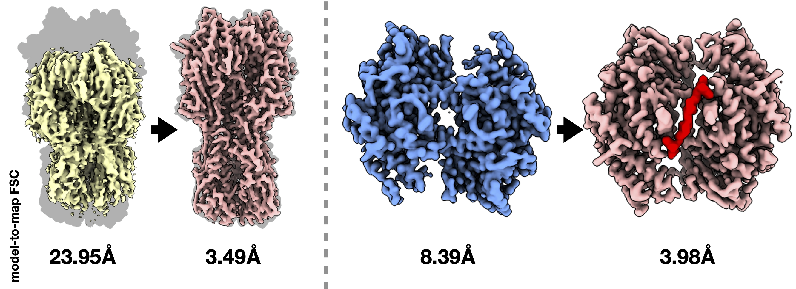
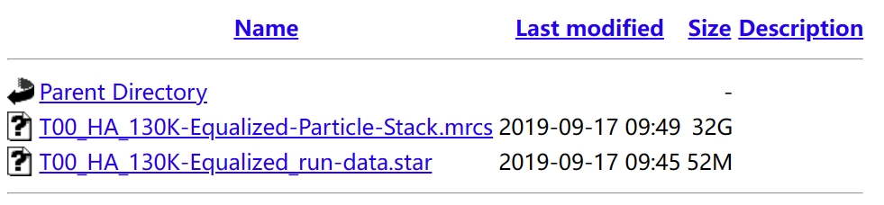
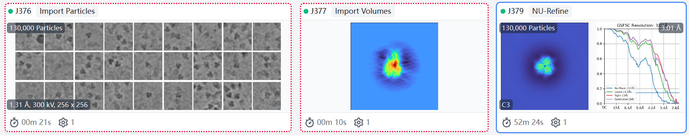
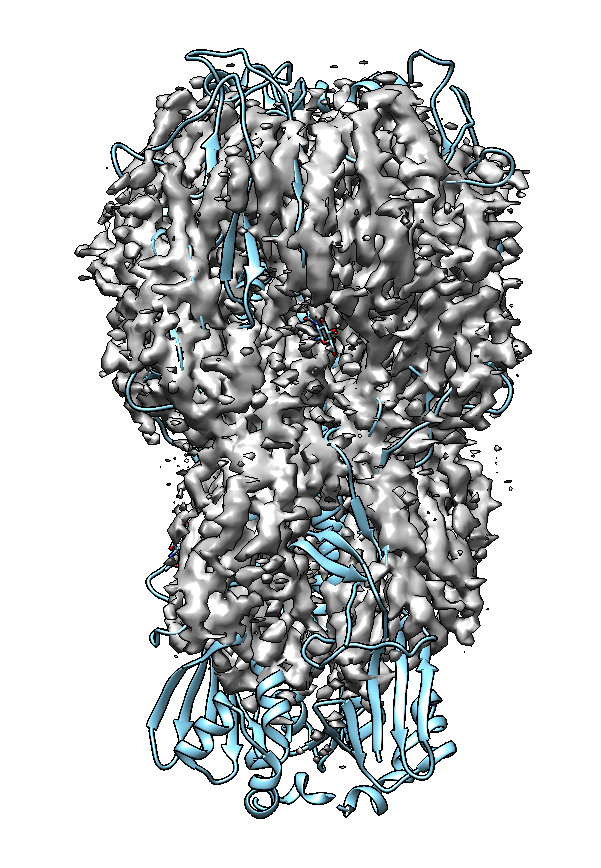
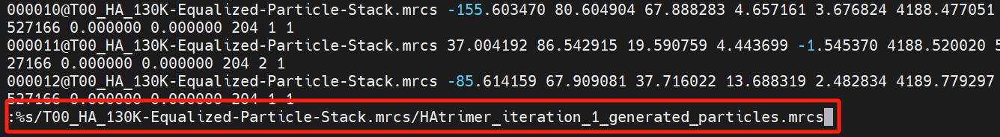
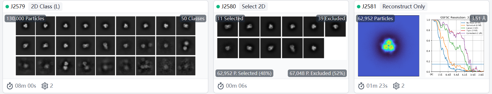
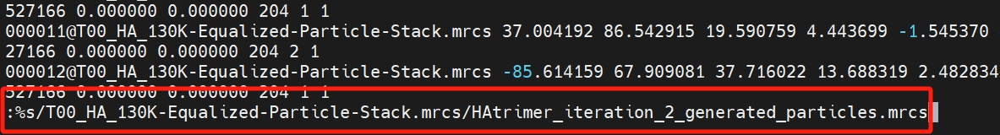

# CryoPROS: addressing preferred orientation in single-particle cryo-EM through AI-generated auxiliary particles
CryoPROS is a computational framework specifically designed to tackle misalignment errors caused by preferred orientation issues in single-particle cryo-EM. It addresses these challenges by co-refining synthesized and experimental data. By utilizing a self-supervised deep generative model, cryoPROS synthesizes auxiliary particles that effectively eliminate these misalignment errors through a co-refinement process.

## Video Tutorial
[TBD]

## Preprint
For more details, please refer to the preprint ["Addressing preferred orientation in single-particle cryo-EM through AI-generated auxiliary particles"](https://www.biorxiv.org/content/10.1101/2023.09.26.559492v1).

## The List of Available Demo Cases

| dataset |cast study |
| ----------- | ----------------- |
| untitled HA-trimer (EMPIAR-10096) | [link](#case-study-achieving-349å-resolution-for-an-untitled-ha-trimer-empiar-10096) |

# Installation

CryoPROS is free software developed in Python and is available as a Python package. You can access its distributions [on GitHub](https://github.com/mxhulab/crypros).

## Prerequisites

- Python version 3.12.
- NVIDIA CUDA library 10.2 or later installed in the user's environment.

## Dependencies

- torch
- torchvision
- mrcfile>=1.3
- scipy>=1.6.2
- tqdm>=4.59
- argparse>=1.4
- numpy>=1.21.5
- pandas>=1.3.2
- opencv-python
- matplotlib

All dependencies except for torch and torchvision can be managed by Pip during the installation of cryoPROS.

## Preparation of CUDA Environment

### Creating and Activating a Conda Virtual Environment

First, create a Conda virtual environment named `CRYOPROS_ENV` with Python 3.10 by running the following command:
```
conda create -n CRYOPROS_ENV python==3.12
```

After creating the environment, activate it using:
```
conda activate CRYOPROS_ENV
```

### Installing PyTorch and Torchvision

Install the versions of PyTorch and torchvision that correspond to your specific environment, particularly matching your CUDA Driver Version. Use the following command, replacing `{x.x.x}` with the appropriate version numbers and `{xxx}` with your CUDA version:

```
pip install torch=={x.x.x} torchvision=={x.x.x} --extra-index-url https://download.pytorch.org/whl/cu{xxx}
```

For example, to install PyTorch 2.2.2 and torchvision 0.17.2 for CUDA Driver 10.2, you would use:
```
pip install torch==2.2.2 torchvision==0.17.2 --extra-index-url https://download.pytorch.org/whl/cu102
```

## Installing CryoPROS
Download the precompiled package `cryoPROS-1.0-cp312-cp312-linux_x86_64.whl` [from the GitHub repository](https://github.com/mxhulab/crypros).
```
pip install cryoPROS-1.0-cp312-cp312-linux_x86_64.whl
```

## Verifying Installation
You can verify whether cryoPROS has been installed successfully by running the following command:
```
cryopros-generate -h
```
This should display the help information for cryoPROS, indicating a successful installation.

# Tutorial

## Workflow Diagram of CryoPROS


CryoPROS is composed of two primary modules: the generative module and the co-refinement module, and includes an optional sub-module for heterogeneous reconstruction.

## Five Executable Binaries Included in CryoPROS

CryoPROS consists of five executable binaries, as listed in the following table:

| binary name | category | purpose | options/argument |
| ------------ |--------- | --------- | --------------- |
| `cryopros-train ` | core | Training a conditional VAE deep neural network model from an input initial volume and raw particles with given imaging parameters. | [see](#optionsarguments-of-cryopros-train) |
| `cryopros-generate` | core | Generating an auxiliary particle stack from a pre-trained conditional VAE deep neural network model. | [see](#optionsarguments-of-cryopros-generate) |
| `cryopros-uniform-pose` | utility | Replacing poses in the input star file with poses sampled from a uniform distribution of spatial rotations. | [see](#optionsarguments-of-cryopros-uniform-pose) |
| `cryopros-gen-mask` | utility | Generating a volume mask for a given input volume and corresponding threshold. | [see](#optionsarguments-of-cryopros-gen-mask) |
| `cryopros-recondismic` | optional | Reconstructing the micelle/nanodisc density map from an input initial volume, a mask volume and raw particles with given imaging parameters. | [see](#optionsarguments-of-cryopros-recondismic) |

## Integrating CryoPROS's Executable Binaries with Cryo-EM Softwares to Address Preferred Orientation Challenges

Using cryoPROS to address the preferred orientation issue in single-particle cryo-EM involves integrating these submodules with other cryo-EM software, such as Relion, CryoSPARC, EMReady and cryoDRGN. This integration is user-defined and can be customized based on different datasets. To demonstrate the effectiveness of cryoPROS, case studies are provided.

## Case Study: Achieving 3.49Å Resolution for an Untitled HA-Trimer (EMPIAR-10096)

CryoPROS facilitates the recovery of near-atomic-resolution details from the untitled HA-trimer dataset.


- **a**, The top row illustrates the pose distribution obtained through the tilt strategy (130,000 particles), while the middle (side view) and bottom rows  (top view) depict the reconstructed density maps of the tilt-collected dataset: autorefinement (pink) and state-of-the-art results (violet). Notably, achieving the state-of-the-art result necessitates intricate subsequent refinements at the per-particle level, involving multi-round 3D classification, defocus refinement, and Bayesian polishing.
- **b**, Similar to **a**, with the first row showcasing the pose distribution of untilted raw particle stacks (130,000 particles), the generated particles (130,000 particles), and selected subset for local refinement (31,146 particles). Reconstructed density maps of the untilted dataset, including autorefinement (yellow), cryoPROS (cyan), and cryoPROS with follow-up local refinement (magenta), are presented. Maps in a and b are superimposed on the envelope of the HA-trimer atomic model (PDB ID: 3WHE, grey). 
- **c**, Detailed close-ups of selected parts of the density maps shown in a and b, ordered consistently. The first and second rows display regions of alpha-helix and beta-sheet with low transparency, respectively. The third row and fourth row show the selected regions in gray mesh style, with the embedded atomic model colored by average Q-score.sc value and average Q-score.bb value, respectively.

### Step 1: Download Untitled HA-Trimer Dataset (EMPIAR-10096)

Download [EMPIAR-10096 (~32GB)](https://ftp.ebi.ac.uk/empiar/world_availability/10096/data/Particle-Stack/).
You can download it directly from the command line: 
```
wget -nH -m ftp://ftp.ebi.ac.uk/empiar/world_availability/10096/data/Particle-Stack/
```
This dataset contains 130,000 extracted particles with box size of 256 and pixel size of 1.31Å/pix.



The CTF parameters for each particle are in the metadata file `T00_HA_130K-Equalized_run-data.star`.

### Step 2: Ab-initio auto-refinement

Perform ab-initio auto-refinement:
- Import the downloaded data into relion and execute the **3D initial model** task.
- Import the raw data and initial volume obtained by relion into CryoSPARC and perform the **Non-uniform Refinement** task on raw particles with C3 symmetry.

The expected outcome of the process described above is a density map accompanied by a pose metafile:
- density map: [cryosparc_P68_J379_005_volume_map_sharp.mrc](https://drive.google.com/drive/folders/1VpVpBujJ0qlPEtWYzgfbkNF39oTVeIro?usp=sharing).
- pose metafile (e.g., named `cryosparc_P68_J379_005_particles.cs`) containing information about estimated pose parameters.



This pose metafile needs to be converted into the STAR file format to facilitate downstream training. This conversion can be achieved using `csparc2star.py` from the [`pyem`](https://github.com/asarnow/pyem).
```
python csparc2star.py cryosparc_P68_J379_005_particles.cs autorefinement.star
```
The expected result, `autorefinement.star`, which includes the estimated pose parameters, can be downloaded from [this link](https://drive.google.com/drive/folders/1VpVpBujJ0qlPEtWYzgfbkNF39oTVeIro?usp=sharing).

### Step 3: Generate the initial latent volume

- The initial latent volume is generated using the homologous protein atomic model, selected from PDB ID: 6IDD, specifically chains a, g, and e.
- Fit this atomic model it into [the density map gained via previous auto-refinement, i.e., cryosparc_P68_J379_005_volume_map_sharp.mrc](https://drive.google.com/drive/folders/1VpVpBujJ0qlPEtWYzgfbkNF39oTVeIro?usp=sharing) in Chimera, then run the following commands in the Chimera command line:
```
molmap #1 2.62 onGrid #0
save #1 6idd_align.mrc
```
<p align="center">

</p>

Finnaly, use Relion to apply low-pass filtering to the aligned volume (6idd_align.mrc), which will generate the initial latent volume `6idd_align_lp10.mrc` necessary for the first iteration of training in cryoPROS, via the command:
```
relion_image_handler --i 6idd_align.mrc --o 6idd_align_lp10.mrc --lowpass 10
```
The expected result, `6idd_align_lp10.mrc`, can be downloaded from [this link](https://drive.google.com/drive/folders/1iORgW1831wCsg4wliRPq0pasIo2F-Ymo?usp=sharing).

### Step 4: Iteration 1: Train the neural network in the generative module

The particles `T00_HA_130K-Equalized-Particle-Stack.mrcs` and their refined poses, available at [`autorefinement.star`](https://drive.google.com/drive/folders/1VpVpBujJ0qlPEtWYzgfbkNF39oTVeIro?usp=sharing), are utilized to train the neural network within the generative module. This training starts with the initial latent volume, which can be accessed at [`6idd_align_lp10.mrc`](https://drive.google.com/drive/folders/1iORgW1831wCsg4wliRPq0pasIo2F-Ymo?usp=sharing), via command:
```
cryopros-train \
--opt {CONDA_ENV_PATH}/lib/python3.12/site-packages/cryoPROS/options/train.json \
--gpu_ids 0 1 2 3 \
--task_name HAtrimer_iteration_1 \
--box_size 256 \
--Apix 1.31 \
--volume_scale 50 \
--init_volume_path 6idd_align_lp10.mrc \
--data_path T00_HA_130K-Equalized-Particle-Stack.mrcs \
--param_path autorefinement.star \
--invert \
--dataloader_batch_size 8
```
`{CONDA_ENV_PATH}` is the location of the `CRYOPROS_ENV`, the Conda environment created during the installation process. If [Anaconda 3](https://www.anaconda.com) is used to create the Conda environment, then `{CONDA_ENV_PATH}` should be set to `{ANACONDA_INSTALLATION_PATH}/envs/CRYOPROS_ENV`.
Moreover, 4 GPUs are utilized for training in the aforementioned setting. Adjust the `--gpu_ids` option to accommodate your computing environment.

Upon completion of the above command:
- A directory named `./generate/HAtrimer_iteration_1` will be created.
- The training log will be stored at `./generate/HAtrimer_iteration_1/train.log`.
- The trained neural networks will be saved under `./generate/HAtrimer_iteration_1/models/`.

The expected trained neural network (`HAtrimer_iteration_1.pth`) can be downloaded from [this link](https://drive.google.com/drive/folders/1dednUnZp-crUg_iXvl6czFUjAhFehjOq?usp=sharing).

### Step 5: Iteration 1: Generate auxiliary particles with the trained neural network

Auxiliary particles should display uniform poses. Therefore, the initial phase involves replacing the poses in the input star file, [`autorefinement.star`](https://drive.google.com/drive/folders/1VpVpBujJ0qlPEtWYzgfbkNF39oTVeIro?usp=sharing), with poses sampled from a uniform distribution of spatial rotations, which can be accomplised via:
```
cryopros-uniform-pose \
--input ./autorefinement.star \
--ouput ./unipose.star \
```
The expected `unipose.star` can be downloaded from [this link](https://drive.google.com/drive/folders/1dednUnZp-crUg_iXvl6czFUjAhFehjOq?usp=sharing).

Next, the auxiliary particles are generated using the neural network that was trained in the preceding step, with the command
```
cryopros-generate \
--model_path HAtrimer_iteration_1.pth \
--output_path generated_HAtrimer_iteration_1 \
--gen_name HAtrimer_iteration_1_generated_particles.mrcs \
--batch_size 50 \
--box_size 256 \
--Apix 1.31 \
--param_path unipose.star \
--invert \
--gen_mode 0
```

Generated auxiliary particles are output in `./generated_HAtrimer_iteration_1/HAtrimer_iteration_1_generated_particles.mrcs`.

To update the particle root in the starfile for the generated particles from `unipose.star`, use the following command in vim:



### Step 6: Iteration 1: Co-refinement using a combination of raw particles and synthesized auxiliary particles

Perform **Non-uniform Refinement** in cryoSPARC using a combination of raw particles (`T00_HA_130K-Equalized-Particle-Stack.mrcs`) and synthesized auxiliary particles (`HAtrimer_iteration_1_generated_particles.mrcs`). The parameter settings for this process are:
- Initial volume: [`6idd_align_lp10.mrc`](https://drive.google.com/drive/folders/1iORgW1831wCsg4wliRPq0pasIo2F-Ymo?usp=sharing).
- Symmetry: C3.
- Other parameters: default.

### Step 7: Iteration 1: Reconstruction-only with raw particles and their pose esimated in the co-refinement step

After completing the co-refinement, use the **Particle Sets Tool** in cryoSPARC to separate the raw particles from the combination of raw and synthesized auxiliary particles.

[Optional] Conduct 2D classification of raw particles and manual pick a subset with less top view (62,952 particles).



Next, export the poses of the raw particles as a star file (`2581.star`) by exporting the cryoSPARC job and using the `csparc2star.py` script from the pyem package.

The expected result (`2581.star`) can be downloaded from [this link](https://drive.google.com/drive/folders/1t_NYeR_CAbMq8OWZchIbXf8UND2wrrkt?usp=sharing).

Then, execute **Homogeneous Reconstruction Only** task on raw particles subset. The expected density map (`cryosparc_P68_J2581_volume_map_sharp.mrc`) can be download from [this link](https://drive.google.com/drive/folders/1t_NYeR_CAbMq8OWZchIbXf8UND2wrrkt?usp=sharing).

Finally, Use Relion to generate the subset stack (`raw_iter_2.mrcs`) by this command:
```
relion_stack_create --i 2581.star --o raw_iter2
```

### Step 8: Iteration 2: Train the neural network in the generative module

The training process follows the approach outlined in **Step 4**.

```
cryopros-train \
--opt {CONDA_ENV_PATH}/lib/python3.12/site-packages/cryoPROS/options/train.json \
--gpu_ids 0 1 2 3 \
--task_name HAtrimer_iteration_2 \
--box_size 256 \
--Apix 1.31 \
--volume_scale 50 \
--cryosparc_P68_J2581_volume_map_sharp.mrc \
--data_path raw_iter_2.mrcs \
--param_path 2581.star \
--invert \
--dataloader_batch_size 8
```

Upon completion of the above command:
- A directory named `./generate/HAtrimer_iteration_2` will be created.
- The training log will be stored at `./generate/HAtrimer_iteration_2/train.log`.
- The trained neural networks will be saved under `./generate/HAtrimer_iteration_2/models/`.

The expected trained neural network (`HAtrimer_iteration_2.pth`) can be downloaded from [this link](https://drive.google.com/drive/folders/1dednUnZp-crUg_iXvl6czFUjAhFehjOq?usp=sharing).

### Step 9: Iteration 2: Generate auxiliary particles with the trained neural network

The generating process follows the approach outlined in **Step 5**.

```
cryopros-generate \
--model_path HAtrimer_iteration_2.pth \
--output_path generated_HAtrimer_iteration_2/ \
--gen_name HAtrimer_iteration_2_generated_particles.mrcs \
--batch_size 50 \
--box_size 256 \
--Apix 1.31 \
--param_path unipose.star \
--invert \
--gen_mode 0 \
```

Generated auxiliary particles are output in `./generated_HAtrimer_iteration_2/HAtrimer_iteration_2_generated_particles.mrcs`.

To update the particle root in the starfile for the generated particles from `unipose.star`, use the following command in vim:



### Step 10: Iteration 2: Co-refinement using a combination of raw particles and synthesized auxiliary particles

The co-refinement process is identical to that described in **Step 6**, with the only difference being the use of the auxiliary particle stack `HAtrimer_iteration_2_generated_particles.mrcs` instead of `HAtrimer_iteration_1_generated_particles.mrcs`.

### Step 11: Iteration 2: Reconstruction-only with raw particles and their pose esimated in the co-refinement step

This step mirrors **Step 7**, with the exception that the optional 2D classification followed by selection is omitted.

The expected result, consisting of poses of raw particles obtained from the second iteration co-refinement and named `2596.star`, can be downloaded from [this link](https://drive.google.com/drive/folders/1cmkHdp6UAuFs0R__-6ZK96yxcRffqZAJ?usp=sharing).

The expected density map (`cryosparc_P68_J2599_volume_map_sharp.mrc`) can be downloaded from [this link](https://drive.google.com/drive/folders/1cmkHdp6UAuFs0R__-6ZK96yxcRffqZAJ?usp=sharing).

### Step 12: Post-processing by EMReady

Install [EMReady](http://huanglab.phys.hust.edu.cn/EMReady/v2.0/EMReady_v2.0.tgz) by following the instructions provided.

Next, postprocess the density map obtained in the previous step using the following command:
```
EMReady.sh cryosparc_P68_J2599_volume_map_sharp.mrc 2599_refined.mrc
relion_image_handler --i 2599_refined.mrc --o 2599_refined.mrc --new_box 256 --rescale_angpix 1.31
```

The expected processed density map ('2599_refined.mrc') can be downloaded from [this link](https://drive.google.com/drive/folders/1cmkHdp6UAuFs0R__-6ZK96yxcRffqZAJ?usp=sharing).

### Step 13: Local Refinement

This step involves performing local refinement on a subset of particles that exhibit relatively balanced poses:

Firstly, conduct a 2D classification of the raw particles using the [`2596.star`](https://drive.google.com/drive/folders/1cmkHdp6UAuFs0R__-6ZK96yxcRffqZAJ?usp=sharing) file. Manually select a subset of particles with balanced poses, such as those in [`2599_subset.star`](https://drive.google.com/drive/folders/1xPHg9zVZjUGuFBIb_1D91iAuW2WEvt90?usp=sharing), which contains 31,146 particles.

Then, perform a **Homogeneous Reconstruction Only** on this selected subset to obtain a density map and corresponding mask file. The results are available at [`cryosparc_P68_J4657_volume_map_sharp.mrc`](https://drive.google.com/drive/folders/1xPHg9zVZjUGuFBIb_1D91iAuW2WEvt90?usp=sharing) and [`cryosparc_P68_J4657_volume_mask_fsc.mrc`](https://drive.google.com/drive/folders/1xPHg9zVZjUGuFBIb_1D91iAuW2WEvt90?usp=sharing) respectively.

Finally, perform a **Local Refinement** task using the following settings:
- Particle stacks: [`2599_subset.star`](https://drive.google.com/drive/folders/1xPHg9zVZjUGuFBIb_1D91iAuW2WEvt90?usp=sharing) file.
- Initial volume: [`2599_refined.mrc`](https://drive.google.com/drive/folders/1cmkHdp6UAuFs0R__-6ZK96yxcRffqZAJ?usp=sharing).
- Static mask: [`cryosparc_P68_J4657_volume_mask_fsc.mrc`](https://drive.google.com/drive/folders/1xPHg9zVZjUGuFBIb_1D91iAuW2WEvt90?usp=sharing).
- Initial lowpass resolution (Å): 4
- Symmetry: C3
- Other parameters: default

The expected refined density map ('cryosparc_P68_J4826_volume_map_sharp.mrc') can be downloaded from [this link](https://drive.google.com/drive/folders/1xPHg9zVZjUGuFBIb_1D91iAuW2WEvt90?usp=sharing).

### Step 14: Post-processing by EMReady

This step is identical to **Step 12**.

The expected processed density map (`4826_refined.mrc`) can be downloaded from [this link](https://drive.google.com/drive/folders/1xPHg9zVZjUGuFBIb_1D91iAuW2WEvt90?usp=sharing).
# Options/Arguments

<a name="cryopros-train"></a>
## Options/Arguments of `cryopros-train`

```
$ cryopros-train -h
usage: cryopros-train [-h] --box_size BOX_SIZE --Apix APIX --init_volume_path INIT_VOLUME_PATH --data_path
                     DATA_PATH --param_path PARAM_PATH --gpu_ids GPU_IDS [GPU_IDS ...] [--invert] [-opt OPT]
                     [--task_name TASK_NAME] [--volume_scale VOLUME_SCALE]
                     [--dataloader_batch_size DATALOADER_BATCH_SIZE]
                     [--dataloader_num_workers DATALOADER_NUM_WORKERS] [--lr LR] [--KL_weight KL_WEIGHT]
                     [--max_iter MAX_ITER]

Training a conditional VAE deep neural network model from an input initial volume and raw particles with given
imaging parameters.

options:
  -h, --help            show this help message and exit
  --box_size BOX_SIZE   box size
  --Apix APIX           pixel size in Angstrom
  --init_volume_path INIT_VOLUME_PATH
                        input inital volume path
  --data_path DATA_PATH
                        input raw particles path
  --param_path PARAM_PATH
                        path of star file which contains the imaging parameters
  --gpu_ids GPU_IDS [GPU_IDS ...]
                        GPU IDs to utilize
  --invert              invert the image sign
  --opt OPT             path to option JSON file
  --task_name TASK_NAME
                        task name
  --volume_scale VOLUME_SCALE
                        scale factor
  --dataloader_batch_size DATALOADER_BATCH_SIZE
                        batch size to load data
  --dataloader_num_workers DATALOADER_NUM_WORKERS
                        number of workers to load data
  --lr LR               learning rate
  --KL_weight KL_WEIGHT
                        KL weight
  --max_iter MAX_ITER   max number of iterations
```

<a name="cryopros-generate"></a>
## Options/Arguments of `cryopros-generate`

```
$ cryopros-generate -h
usage: cryopros-generate [-h] --model_path MODEL_PATH --output_path OUTPUT_PATH --box_size BOX_SIZE --Apix APIX --gen_name GEN_NAME --param_path
                              PARAM_PATH [--invert] [--batch_size BATCH_SIZE] [--num_max NUM_MAX] [--data_scale DATA_SCALE] [--gen_mode GEN_MODE]
                              [--nls NLS [NLS ...]]

Generating an auxiliary particle stack from a pre-trained conditional VAE deep neural network model.

options:
  -h, --help            show this help message and exit
  --model_path MODEL_PATH
                        input pretrained model path
  --output_path OUTPUT_PATH
                        output output synthesized auxiliary particle stack
  --box_size BOX_SIZE   box size
  --Apix APIX           pixel size in Angstrom
  --gen_name GEN_NAME   filename of the generated auxiliary particle stack
  --param_path PARAM_PATH
                        path of star file which contains the imaging parameters
  --invert              invert the image sign
  --batch_size BATCH_SIZE
                        batch size
  --num_max NUM_MAX     maximum number particles to generate
  --data_scale DATA_SCALE
                        scale factor
  --gen_mode GEN_MODE   storage model of the synthesized particles; mode 0 is int; mode 2 is float
  --nls NLS [NLS ...]   number of layers of the neural network
```

<a name="cryopros-uniform-pose"></a>
## Options/Arguments of `cryopros-uniform-pose`

```
$ cryopros-uniform-pose -h
usage: cryopros-uniform-pose [-h] --input INPUT --output OUTPUT

Replacing poses in the input star file with poses sampled from a uniform distribution of spatial rotations.

options:
  -h, --help       show this help message and exit
  --input INPUT    input star file filename
  --output OUTPUT  output star file filename
```

<a name="cryopros-gen-mask"></a>
## Options/Arguments of `cryopros-gen-mask`

```
$ cryopros-gen-mask -h
usage: cryopros-gen-mask [-h] [-h] --volume_path VOLUME_PATH --result_path RESULT_PATH --threshold THRESHOLD

Generating a volume mask for a given input volume and corresponding threshold.

options:
  -h, --help            show this help message and exit
  --volume_path VOLUME_PATH
                        input volume path
  --result_path RESULT_PATH
                        output mask path
  --threshold THRESHOLD
```

<a name="cryopros-recondismic"></a>
## Options/Arguments of `cryopros-recondismic`

```
$ cryopros-recondismic -h
usage: cryopros-recondismic [-h] --box_size BOX_SIZE --Apix APIX --init_volume_path INIT_VOLUME_PATH --mask_path
                        MASK_PATH --data_path DATA_PATH --param_path PARAM_PATH --gpu_ids GPU_IDS [GPU_IDS ...]
                        [--invert] [--opt OPT] [--task_name TASK_NAME] [--volume_scale VOLUME_SCALE]
                        [--dataloader_batch_size DATALOADER_BATCH_SIZE]
                        [--dataloader_num_workers DATALOADER_NUM_WORKERS] [--lr LR] [--KL_weight KL_WEIGHT]
                        [--max_iter MAX_ITER]

Reconstructing the micelle/nanodisc density map from an input initial volume, a mask volume and raw particles
with given imaging parameters.

options:
  -h, --help            show this help message and exit
  --box_size BOX_SIZE   box size
  --Apix APIX           pixel size in Angstrom
  --init_volume_path INIT_VOLUME_PATH
                        input inital volume path
  --mask_path MASK_PATH
                        mask volume path
  --data_path DATA_PATH
                        input raw particles path
  --param_path PARAM_PATH
                        path of star file which contains the imaging parameters
  --gpu_ids GPU_IDS [GPU_IDS ...]
                        GPU IDs to utilize
  --invert              invert the image sign
  --opt OPT             path to option JSON file
  --task_name TASK_NAME
                        task name
  --volume_scale VOLUME_SCALE
                        scale factor
  --dataloader_batch_size DATALOADER_BATCH_SIZE
                        batch size to load data
  --dataloader_num_workers DATALOADER_NUM_WORKERS
                        number of workers to load data
  --lr LR               learning rate
  --KL_weight KL_WEIGHT
                        KL weight
  --max_iter MAX_ITER   max number of iterations
```
