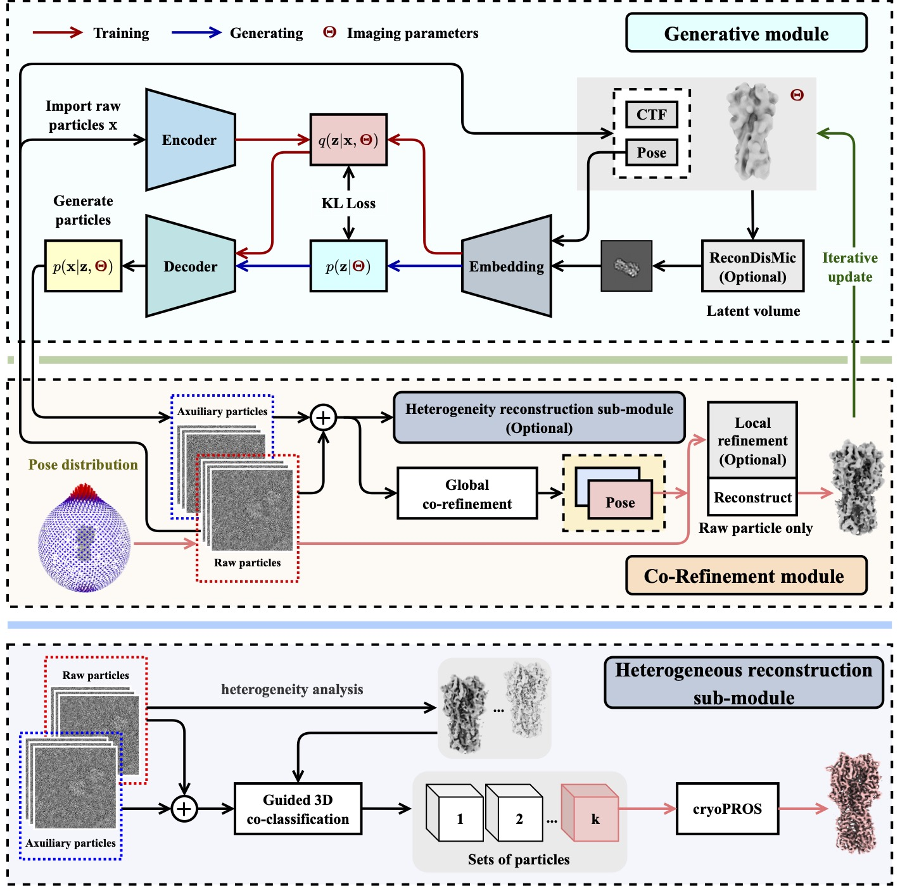

# CryoPROS: addressing preferred orientation in single-particle cryo-EM through AI-generated auxiliary particles
CryoPROS is a computational framework specifically designed to tackle misalignment errors caused by preferred orientation issues in single-particle cryo-EM. It addresses these challenges by co-refining synthesized and experimental data. By utilizing a self-supervised deep generative model, CryoPROS synthesizes auxiliary particles that effectively eliminate these misalignment errors through a co-refinement process.

## Video Tutorial
[TBD]

## Preprint
For more details, please refer to the preprint ["Addressing preferred orientation in single-particle cryo-EM through AI-generated auxiliary particles"](https://www.biorxiv.org/content/10.1101/2023.09.26.559492v1).

## The List of Available Demo Cases

| dataset |expected result link |
| ----------- | ----------------- |
| HA-trimer (EMPIAR-10096) | [TBD] |

# Installation

CryoPROS is free software developed in Python and is available as a Python package. You can access its distributions [on GitHub](https://github.com/mxhulab/crypros).

## Prerequisites

- Python version 3.10.
- NVIDIA CUDA library 10.2 or later installed in the user's environment.

## Dependencies

[TBD]

## Preparation of CUDA Environment

### Creating and Activating a Conda Virtual Environment

First, create a Conda virtual environment named `CRYOPROS_ENV` with Python 3.10 by running the following command:
```
conda create -n CRYOPROS_ENV python==3.10
```

After creating the environment, activate it using:
```
conda activate CRYOPROS_ENV
```

### Installing PyTorch and Torchvision

Install the versions of PyTorch and torchvision that correspond to your specific environment, particularly matching your CUDA Driver Version. Use the following command, replacing `{x.x.x}` with the appropriate version numbers and `{xxx}` with your CUDA version:

```
pip install torch=={x.x.x} torchvision=={x.x.x} --extra-index-url https://download.pytorch.org/whl/cu{xxx}
```

For example, to install PyTorch 1.11.0 and torchvision 0.12.0 for CUDA Driver 10.2, you would use:
```
pip install torch==1.11.0+cu102 torchvision==0.12.0+cu102 --extra-index-url https://download.pytorch.org/whl/cu102
```

## Installing CryoPROS
```
pip install cryoPROS-1.3-cp310-cp310-linux_x86_64.whl
```

## Verifying Installation
You can verify whether cryoPROS has been installed successfully by running the following command:
```
cryopros-generate -h
```
This should display the help information for cryoPROS, indicating a successful installation.

# Tutorial

## Workflow Diagram of CryoPROS



CryoPROS is composed of two primary modules: the generative module and the co-refinement module, and includes an optional sub-module for heterogeneous reconstruction.

## Five Executable Binaries Included in CryoPROS

CryoPROS consists of five executable binaries, as listed in the following table:

| binary name | category | purpose | options/argument |
| ------------ |--------- | --------- | --------------- |
| `cryopros-train ` | core |Training the deep generative neural network that generates auxiliary particles. | [see](#optionsarguments-of-cryopros-train) |
| `cryopros-generate` | core | Generating auxiliary particles. | [see](#optionsarguments-of-cryopros-generate) |
| `cryopros-uniform-pose` | utility | Replacing poses in the input star file with poses sampled from a uniform distribution of spatial rotations. | [see](#optionsarguments-of-cryopros-uniform-pose) |
| `cryopros-gen-mask` | utility | Generating a volume mask for a given input volume and corresponding threshold. | [see](#optionsarguments-of-cryopros-gen-mask) |
| `cryopros-recondismic` | optional | | [see](#optionsarguments-of-cryopros-recondismic) |

## Integrating CryoPROS's Executable Binaries with Cryo-EM Softwares to Address Preferred Orientation Challenges

Using cryoPROS to address the preferred orientation issue in single-particle cryo-EM involves integrating these submodules with other cryo-EM software, such as Relion, CryoSPARC, EMReady and cryoDRGN. This integration is user-defined and can be customized based on different datasets. To demonstrate the effectiveness of cryoPROS, case studies are provided.

## Case Study: Achieving 3.49Å Resolution for an Untitled HA-Trimer (EMPIAR-10096)

### Step 1: Download Untitled HA-Trimer Dataset (EMPIAR-10096)

Download [EMPIAR-10096 (~32GB)](https://ftp.ebi.ac.uk/empiar/world_availability/10096/data/Particle-Stack/).
You can download it directly from the command line: 
```
wget -nH -m ftp://ftp.ebi.ac.uk/empiar/world_availability/10096/data/Particle-Stack/
```
This dataset contains 130,000 extracted particles with box size of 256 and pixel size of 1.31Å/pix.


The CTF parameters for each particle are in the metadata file `T00_HA_130K-Equalized_run-data.star`.

# Options/Arguments

<a name="cryopros-train"></a>
## Options/Arguments of `cryopros-train`

[TBD]

<a name="cryopros-generate"></a>
## Options/Arguments of `cryopros-generate`

[TBD]

<a name="cryopros-uniform-pose"></a>
## Options/Arguments of `cryopros-uniform-pose`

```
$ cryopros-uniform-pose -h
usage: cryopros-uniform-pose [-h] --input INPUT --output OUTPUT

Replacing poses in the input star file with poses sampled from a uniform distribution of spatial rotations.

options:
  -h, --help       show this help message and exit
  --input INPUT    input star file filename
  --output OUTPUT  output star file filename
```

<a name="cryopros-gen-mask"></a>
## Options/Arguments of `cryopros-gen-mask`

```
$ cryopros-gen-mask -h
usage: cryopros-gen-mask [-h] [-h] --volume_path VOLUME_PATH --result_path RESULT_PATH --threshold THRESHOLD

Generating a volume mask for a given input volume and corresponding threshold.

options:
  -h, --help            show this help message and exit
  --volume_path VOLUME_PATH
                        input volume path
  --result_path RESULT_PATH
                        output mask path
  --threshold THRESHOLD
```

<a name="cryopros-recondismic"></a>
## Options/Arguments of `cryopros-recondismic`

[TBD]
